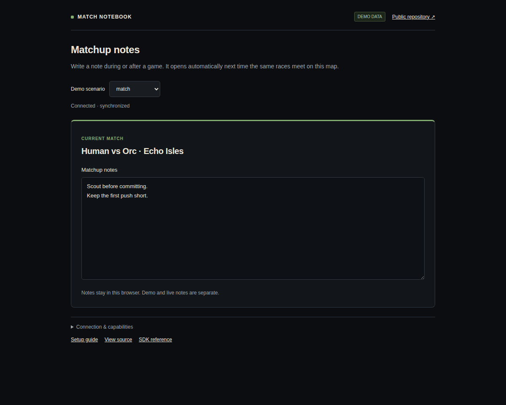

# Match Notebook

One idea: **write a note for the current matchup; show it automatically next time.**

During or after a 1v1 game, select **Create matchup notes** and type into one free-form field. The races and map come from the game. When another game starts with the same matchup on the same map, its note opens automatically. The last matchup stays available after the game ends, including after reloading the app.

[Demo](https://w3booster.github.io/app-example-match-dashboard/) · [Developer guide](https://website.w3booster.com/developer/first-app/) · [All examples](https://website.w3booster.com/developer/examples/)

## Run

Use Node.js 22.22.3 or newer. No account or running game is needed for the demo.

```sh
git clone https://github.com/W3Booster/app-example-match-dashboard.git
cd app-example-match-dashboard
npm ci
npm run dev
```

Open **http://localhost:5173/**. Create a note, switch the demo scenario to **no match**, then back to **match**: your note remains available and reopens without a click.

## Read the example

- [src/notebook.ts](src/notebook.ts): receive match updates, open the matching note, save typing. This is the example's main idea.
- [src/notebook-model.ts](src/notebook-model.ts): identify the two races and map. Matching is directional and ignores only map-name casing and surrounding whitespace.
- [src/notebook-storage.ts](src/notebook-storage.ts): browser-local persistence. The migration helper only preserves earlier versions of this published example; new projects don't need it.
- [src/main.ts](src/main.ts): SDK startup, connection status and cleanup.
- [src/notebook.css](src/notebook.css): compact W3Booster-style dark surfaces with a green accent.

No plan builder, snapshot collection, search, import/export, general-map advice or overlay. This is a small starting point, not a complete notes product. Observers choose a player; incomplete data and team games do not create misleading 1v1 notes. Live ticks never replace the text field while typing.

Notes stay in the current browser profile, separately for demo/live. They are not cloud-synced or account-isolated. Clearing browser data removes them. Failed saves are shown explicitly; copy your text before closing if saving fails. Existing structured notes are flattened into text, and original storage is left untouched. Older notes without an exact matchup are available in a collapsed recovery panel, only for users who had them.

## Connect your fork

1. Enable Developer Mode in W3Booster and create an app using [app-definition.json](app-definition.json).
2. Register **Application only** at `http://localhost:5173/?demo=0`, with `match:read` and `players:read`. No settings or overlay URLs are needed.
3. Run `npm run app:fork -- YOUR_NEW_CLIENT_ID`, then use **Test locally** in W3Booster. A source clone does not inherit the official app's authorization.

Failed live authorization never falls back to demo data. After changing a registered contract, use `npm run w3booster:sync`; `npm run w3booster:check` verifies the binding. See the [first-app guide](https://website.w3booster.com/developer/first-app/) for details.

## Verify and publish

```sh
npm run build
npx playwright install chromium
npm run test:browser
npm run screenshots
```

Tests cover actual start/end events, automatic note reopening, last-game editing, persistence, migration, mobile layout and authorization. GitHub Actions checks the app and deploys `dist/` to Pages. In a fork, enable Pages via GitHub Actions and replace the official URLs. Keep credentials and real private notes out of source and screenshots.



MIT licensed; retain [LICENSE](LICENSE). The stable repository name and client ID preserve existing installations. For a complete production starting point, see [Match Vision](https://website.w3booster.com/developer/match-vision/).
